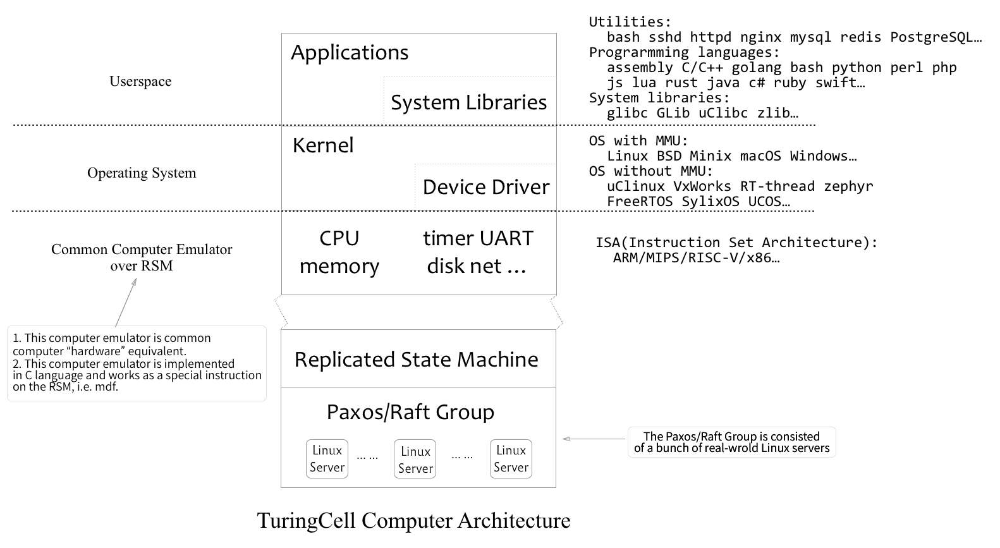

# How Do TuringCell Computer Run?

Status: Sloppy Draft



In TuringCell computer, the Replicated State Machine (abbr. RSM) is implemented over the Paxos/Raft group which is consisted of a bunch of real-world Linux servers. And the computer runs over RSM is not the real hardware -- they are computer emulator which is common computer "hardware" equivalent. 

Assume all the instructions on the RSM tape is a kind of Mathematical Deterministic Function, abbr. mdf.

&emsp;S2 = mdf(S1)

Execution of RSM:

&emsp;S0 --mdf0--> S1 --mdf1--> S2 --mdf2--> S3 ...... Sn --mdfn--> Sn+1 ...... 

State of common computer:

```
computer_state = {
    cpu_state = {
        PC,
        other_registers,
    }, 
    memory_state, 
    io_devices_state = {
        registers_state,
        input_buffer_state,
        output_buffer_state,
    }
}
```

Define the computer's initial state as computer_state0 (the initial state just after the computer is powered on).

```
define mdf_computer_cpu_exec_one_instrution_pointed_by_PC(state_input)   // RSM instruction
    /* ... */

define mdf_computer_io_devices_exec_per_cpu_clk(state_input)             // RSM instruction
    /* ... */

define mdf_computer_exec(state_input)                                    // RSM instruction
    local state1 = mdf_computer_io_devices_exec_per_cpu_clk(state_input) 
    local state2 = mdf_computer_cpu_exec_one_instrution_pointed_by_PC(state1)
    return state2

define mdf_computer_io_input(state_input, data, address)
    // write to computer_state.io_devices_state.input_buffer_state ...
    local state1 = io_device_io_input_write_buffer(state_input, data, address) 
    return state1

define mdf_computer_io_output(state_input, address, length)
    // get data from computer_state.io_devices_state.output_buffer_state ...
    local state1, output_data = io_device_io_output_consume_buffer(state_input, address, length)
    // use this output_data to do anything...
    return state1
```

If all the instructions on the RSM tape are `mdf_computer_exec`/`mdf_computer_io_input`/`mdf_computer_io_output`, then the execution of the RSM should be equivalent to the running of the common computer.

After the initial state being replicated between all replicas of the RSM, the only BIG data that needs to be `chosen` by the Paxos algorithm is the input data of the I/O. Except that, the running of all the replicas is just like the running of the normal computer emulator, thus the performance of the Linux running over TuringCell computer would be no big problems (we could also use some optimizations methods like batching, emulator JIT and etc).


